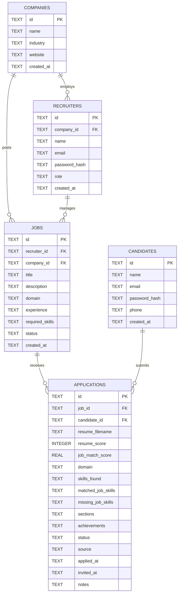
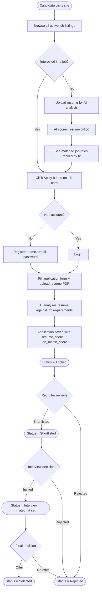
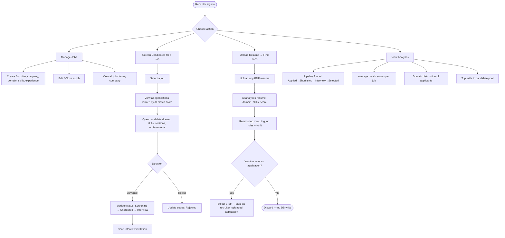
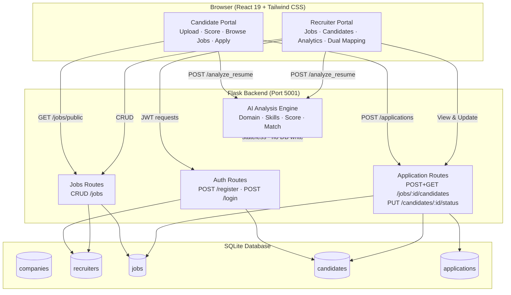

# System Architecture & Database Design

**Project:** Smart Resume Screening and Job Recommendation System
**Institution:** UMIT, SNDT Women's University · Dept. of Data Science
**Team:** Mudra Berde (03), Neeti Bole (09), Disha Waghavle (77)
**Guides:** Dr. Prachi Natu / Prof. Sheetal Mhatre

---

## 1. Architecture Analysis & Design Decisions

### Proposed Flow (from team discussion)

| Proposed Point | Assessment | Recommendation |
|---|---|---|
| Company → Recruiters (1 : many) | ✅ Correct | Add a `companies` table; recruiters belong to one company |
| Recruiter adds jobs (0 to many) | ✅ Correct | Jobs are owned by a recruiter under a company |
| Candidate sees all jobs by company | ✅ Correct | Candidate does **not** see which recruiter posted a job |
| Candidate uploads resume → gets matching jobs | ✅ Correct | Stateless AI analysis, no login needed for this |
| Candidate applies via button | ✅ Correct | Creates an `applications` record (needs candidate account) |
| Recruiter sees all candidates per job | ✅ Correct | Application list ranked by AI match score |
| Recruiter sends interview invitation | ✅ Correct | Modelled as `status = 'Interview'` + `invited_at` timestamp on application |
| Recruiter uploads resume → finds matching jobs | ✅ Correct | Stateless analysis; no DB write needed |

### Improvements Made to the Design

1. **Added `companies` table** — without it the 1:many company→recruiter relationship has no anchor entity.
2. **Added `candidates` table** — anonymous candidates cannot receive interview invitations or track their applications. A lightweight registration (name, email, password) is needed.
3. **Separated `applications` from recruiter-uploaded candidates** — a candidate self-applying vs a recruiter uploading a resume are two different sources. Both create application rows but with a `source` flag (`candidate_applied` / `recruiter_uploaded`).
4. **Added `invited_at` + `notes` to applications** — supports the interview invitation flow without needing a separate invitations table.
5. **Dual mapping clarification** — finding jobs for a candidate is a stateless AI call (no DB write), which is appropriate since it's an analysis tool, not a formal application.

---

## 2. Entity–Relationship Diagram (Crow's Foot Notation)



---

## 3. Database Table Definitions

### 3.1 `companies`

| Column | Type | Constraint | Description |
|---|---|---|---|
| `id` | TEXT | PK | UUID generated on insert |
| `name` | TEXT | NOT NULL, UNIQUE | Company display name |
| `industry` | TEXT | | e.g. Technology, Finance |
| `website` | TEXT | | Optional company URL |
| `created_at` | TEXT | | ISO timestamp |

### 3.2 `recruiters` (replaces `users`)

| Column | Type | Constraint | Description |
|---|---|---|---|
| `id` | TEXT | PK | UUID |
| `company_id` | TEXT | FK → companies | Which company this recruiter belongs to |
| `name` | TEXT | NOT NULL | Full name |
| `email` | TEXT | NOT NULL, UNIQUE | Login email |
| `password_hash` | TEXT | NOT NULL | bcrypt / werkzeug hash |
| `role` | TEXT | DEFAULT 'recruiter' | Future: `admin`, `recruiter` |
| `created_at` | TEXT | | ISO timestamp |

### 3.3 `jobs`

| Column | Type | Constraint | Description |
|---|---|---|---|
| `id` | TEXT | PK | UUID |
| `recruiter_id` | TEXT | FK → recruiters | Who created the job |
| `company_id` | TEXT | FK → companies | Denormalised for fast candidate queries |
| `title` | TEXT | NOT NULL | e.g. Software Engineer |
| `description` | TEXT | NOT NULL | Full job description text |
| `domain` | TEXT | | e.g. Technology, Finance |
| `experience` | TEXT | | e.g. 2–4 years |
| `required_skills` | TEXT | JSON array | `["python","sql","react"]` |
| `status` | TEXT | DEFAULT 'active' | `active` / `closed` |
| `created_at` | TEXT | | ISO timestamp |

### 3.4 `candidates`

| Column | Type | Constraint | Description |
|---|---|---|---|
| `id` | TEXT | PK | UUID |
| `name` | TEXT | NOT NULL | Full name |
| `email` | TEXT | NOT NULL, UNIQUE | Login / contact email |
| `password_hash` | TEXT | NOT NULL | For self-service login |
| `phone` | TEXT | | Optional phone number |
| `created_at` | TEXT | | ISO timestamp |

### 3.5 `applications`

| Column | Type | Constraint | Description |
|---|---|---|---|
| `id` | TEXT | PK | UUID |
| `job_id` | TEXT | FK → jobs | Which job this application is for |
| `candidate_id` | TEXT | FK → candidates, nullable | NULL when recruiter uploads a resume for an unnamed candidate |
| `resume_filename` | TEXT | | Original filename |
| `resume_score` | INTEGER | | 0–100 AI quality score |
| `job_match_score` | REAL | | 0–100 job-specific skill match % |
| `domain` | TEXT | | Auto-detected domain |
| `skills_found` | TEXT | JSON array | Detected skills |
| `matched_job_skills` | TEXT | JSON array | Skills matching job requirements |
| `missing_job_skills` | TEXT | JSON array | Required skills not found |
| `sections` | TEXT | JSON object | Which resume sections were present |
| `achievements` | TEXT | JSON array | Quantified achievements detected |
| `status` | TEXT | DEFAULT 'Applied' | See pipeline below |
| `source` | TEXT | DEFAULT 'candidate_applied' | `candidate_applied` / `recruiter_uploaded` |
| `applied_at` | TEXT | | ISO timestamp of submission |
| `invited_at` | TEXT | nullable | Set when recruiter changes status to Interview |
| `notes` | TEXT | | Recruiter notes on the candidate |

#### Application Status Pipeline

```
Applied → Screening → Shortlisted → Interview → Selected
                                              ↘ Rejected (from any stage)
```

---

## 4. Cardinality Summary

| Relationship | Type | Notes |
|---|---|---|
| Company → Recruiters | 1 : many | A company has one or more recruiters |
| Company → Jobs | 1 : many | A company can post zero or more jobs |
| Recruiter → Jobs | 1 : many | A recruiter manages zero or more jobs |
| Job → Applications | 1 : many | A job receives zero or more applications |
| Candidate → Applications | 1 : many | A candidate can apply to multiple jobs |
| Job ↔ Candidate | many : many | Resolved through `applications` table |

---

## 5. Candidate-Facing Workflow



---

## 6. Recruiter-Facing Workflow



---

## 7. AI Analysis Engine — Data Flow

```mermaid
flowchart LR
    PDF([PDF Resume Upload]) --> EX[Text Extraction\npdfplumber]
    EX --> DOM[Domain Detection\nkeyword scoring across 23 domains]
    DOM --> SK[Skill Extraction\n500+ skills ontology]
    SK --> SEC[Section Detection\n7 resume sections]
    SEC --> ACH[Achievement Detection\nquantified impact patterns]
    ACH --> REP[Repetition Check\nwriting quality]
    REP --> SCORE[Score Engine\n100-point deterministic]
    SCORE --> JM[Job Role Matching\nskill overlap %]
    JM --> OUT([JSON Response\nscore + breakdown + skills\n+ suggestions + matches])
```



---

## 8. System Architecture Overview



---

## 9. API Endpoint Map (Current + Planned)

### Authentication

| Method | Endpoint | Auth | Actor | Description |
|---|---|---|---|---|
| `POST` | `/register` | No | Recruiter | Register recruiter account |
| `POST` | `/login` | No | Recruiter / Candidate | Login, returns JWT |

### Jobs

| Method | Endpoint | Auth | Actor | Description |
|---|---|---|---|---|
| `GET` | `/jobs/public` | No | Candidate | List all active jobs (company name, title, skills) |
| `GET` | `/jobs` | JWT | Recruiter | List recruiter's own jobs |
| `POST` | `/jobs` | JWT | Recruiter | Create a job posting |
| `PUT` | `/jobs/<id>` | JWT | Recruiter | Update a job |
| `DELETE` | `/jobs/<id>` | JWT | Recruiter | Delete / close a job |

### Applications

| Method | Endpoint | Auth | Actor | Description |
|---|---|---|---|---|
| `POST` | `/jobs/<id>/apply` | No / JWT | Candidate | Self-apply with resume + details |
| `POST` | `/jobs/<id>/candidates` | JWT | Recruiter | Upload resume for a job (recruiter mode) |
| `GET` | `/jobs/<id>/candidates` | JWT | Recruiter | List applications ranked by match score |
| `PUT` | `/candidates/<id>/status` | JWT | Recruiter | Update pipeline status |

### AI Analysis

| Method | Endpoint | Auth | Actor | Description |
|---|---|---|---|---|
| `POST` | `/analyze_resume` | No | Anyone | Analyse PDF, returns score + matches (stateless) |

---

## 10. Status Transition Rules

| From | Allowed transitions |
|---|---|
| `Applied` | → Screening, → Rejected |
| `Screening` | → Shortlisted, → Rejected |
| `Shortlisted` | → Interview, → Rejected |
| `Interview` | → Selected, → Rejected |
| `Selected` | — (terminal) |
| `Rejected` | — (terminal) |
